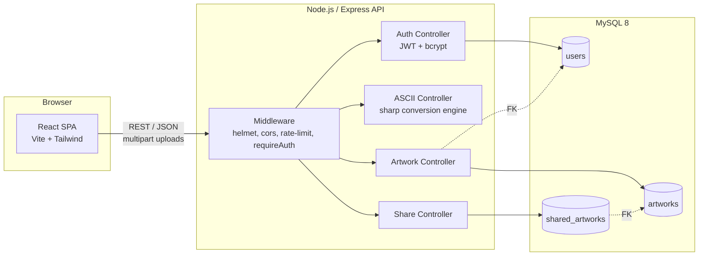
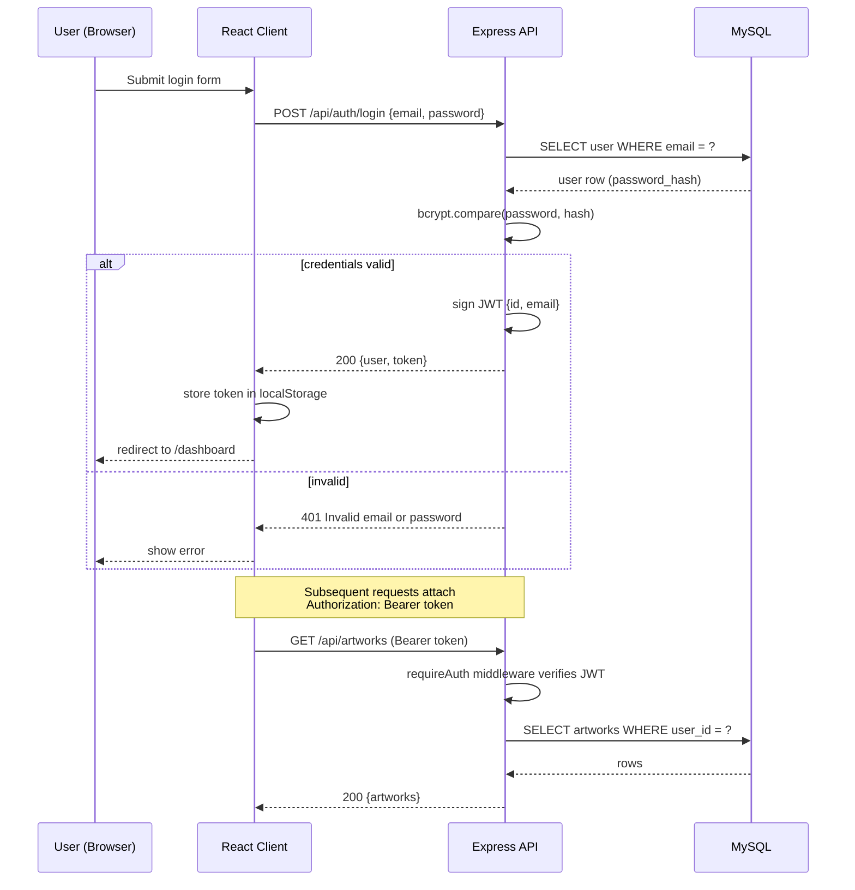

# Architecture

## Overview

ASCII Studio is a three-tier full-stack application:

- **Client** — React + Vite SPA, styled with Tailwind CSS, talks to the API over REST/JSON (and `multipart/form-data` for uploads).
- **Server** — Node.js + Express REST API. Stateless (JWT auth), horizontally scalable.
- **Database** — MySQL 8, accessed exclusively through parameterized queries via `mysql2`.

## System Diagram

## Request Flow (typical authenticated request)

1. Client attaches `Authorization: Bearer <JWT>` header (added automatically by the Axios interceptor).
2. Express middleware chain runs: `helmet` → `cors` → rate limiter → route-specific `requireAuth`.
3. `requireAuth` verifies the JWT and attaches `req.user`.
4. Controller delegates to a service module, which performs parameterized SQL queries.
5. Centralized error handler formats any thrown `AppError` into a consistent JSON error response; unexpected errors are logged server-side and never leak stack traces to the client.

## Why this structure

- **Layered backend** (`routes → controllers → services → db`) keeps HTTP concerns separate from business logic, which is what makes the Jest/Supertest suite able to exercise real business logic through the HTTP layer without duplicating it.
- **Stateless JWT auth** means the API can be scaled behind a load balancer without sticky sessions.
- **In-memory image processing** (`multer.memoryStorage()` + `sharp`) avoids ever writing user-uploaded files to disk — nothing to clean up, nothing to accidentally commit to git.

## Authentication Flow

