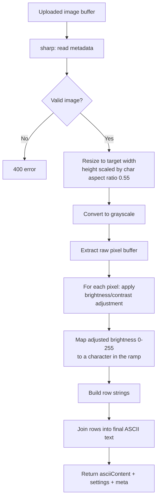

# ASCII Conversion Engine

Location: `server/src/services/asciiService.js`

## Flow



## Why the character aspect ratio matters

Monospace terminal characters are roughly twice as tall as they are wide. If the output height used the image's raw pixel aspect ratio, the ASCII art would look vertically stretched. We compensate with `CHAR_ASPECT_RATIO = 0.55`, so:

```
outputHeight = round((imageHeight / imageWidth) * outputWidth * 0.55)
```

## Brightness/contrast

A classic photo-editing contrast curve is applied per-pixel before ramp mapping:

```
factor = (259 * (contrast + 255)) / (255 * (259 - contrast))
adjusted = factor * (pixel - 128) + 128 + (brightness / 100) * 128
```

Result is clamped to `[0, 255]`.

## Character mapping

Given a character ramp (default `"@%#*+=-:. "`, dark-to-light), the darkest character represents the darkest pixels:

```
charIndex = floor(((255 - adjustedBrightness) / 255) * rampLength)
char = charset[charIndex]
```

When `invert` is enabled, the ramp string is reversed before mapping, flipping which characters represent dark vs. light areas.

## Settings validation

`parseSettings()` clamps and defaults every incoming setting so malformed or malicious input (e.g. `width: 999999`) can never blow up memory or CPU:

- `width`: clamped to 20-300
- `brightness` / `contrast`: clamped to -100..100
- `charset`: falls back to the default ramp if missing or too short

## No hardcoded output

The engine reads every pixel of the resized, grayscaled image and computes its character individually — there is no lookup table of pre-baked ASCII art. This is covered by `server/tests/ascii.test.js`, which asserts the output width in characters matches the requested setting and that different settings produce different output.
