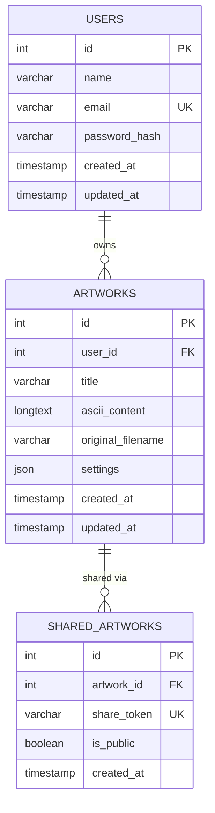

# Database Schema

MySQL 8, InnoDB engine, `utf8mb4` charset.

## Entity-Relationship Diagram

## Tables

### `users`
| Column | Type | Notes |
|---|---|---|
| id | INT UNSIGNED, PK, AUTO_INCREMENT | |
| name | VARCHAR(100) | |
| email | VARCHAR(255) | UNIQUE |
| password_hash | VARCHAR(255) | bcrypt hash, never plaintext |
| created_at / updated_at | TIMESTAMP | |

### `artworks`
| Column | Type | Notes |
|---|---|---|
| id | INT UNSIGNED, PK, AUTO_INCREMENT | |
| user_id | INT UNSIGNED, FK -> users.id | `ON DELETE CASCADE` |
| title | VARCHAR(150) | |
| ascii_content | LONGTEXT | the generated ASCII art |
| original_filename | VARCHAR(255) | |
| settings | JSON | width, charset, invert, brightness, contrast |
| created_at / updated_at | TIMESTAMP | indexed for history sorting |

### `shared_artworks`
| Column | Type | Notes |
|---|---|---|
| id | INT UNSIGNED, PK, AUTO_INCREMENT | |
| artwork_id | INT UNSIGNED, FK -> artworks.id | `ON DELETE CASCADE` |
| share_token | VARCHAR(64) | UNIQUE, random 48-hex-char token |
| is_public | BOOLEAN | only public rows are servable by `/api/share/:token` |
| created_at | TIMESTAMP | |

## Relationships

- `users 1 → many artworks` — a user can own many artworks; deleting a user cascades to their artworks.
- `artworks 1 → many shared_artworks` — modeled as 1-to-many for schema flexibility, though the current application logic maintains at most one active share row per artwork.

## Indexing decisions

- `users.email` — unique index, used on every login/register lookup.
- `artworks.user_id` — indexed, used by the "list my artworks" and ownership-check queries.
- `artworks.created_at` — indexed, used to sort artwork history newest-first.
- `shared_artworks.share_token` — unique index, used by the public share lookup.

## Query safety

All queries go through `mysql2`'s named-placeholder parameterized execution (`pool.execute(sql, { ...params })`). No user input is ever concatenated into SQL strings.
