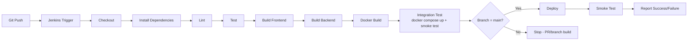

# Jenkins CI/CD

## Pipeline diagram



## Required Jenkins setup

1. **Plugins**: Pipeline, Git, Credentials Binding, (optionally) NodeJS Plugin.
2. **Tools**: a Node.js 20.x installation available on the agent (either via the NodeJS plugin or preinstalled), Docker CLI + daemon access, Git, and a MySQL client (`mysql`) for the test stage's database setup.
3. **Credentials** (Manage Jenkins → Credentials → add "Secret text"):
   - `ascii-studio-jwt-secret` — a random long string
   - `ascii-studio-db-password` — the database password used by the app
   
   These are referenced in the `Jenkinsfile`'s `environment` block via `credentials(...)` and are never hardcoded or echoed to logs.
4. **Job type**: "Pipeline" job, "Pipeline script from SCM", pointing at this repository's `Jenkinsfile` on the `main` branch.

## Creating the Pipeline job

1. New Item → Pipeline → name it `ascii-studio`.
2. Under **Pipeline**, set:
   - Definition: `Pipeline script from SCM`
   - SCM: `Git`
   - Repository URL: your GitHub repo URL
   - Branch: `*/main`
   - Script Path: `Jenkinsfile`
3. Save.

## Triggering automatically on push

To have Jenkins build automatically when code is pushed to GitHub:

1. In the Jenkins job configuration, enable **"GitHub hook trigger for GITScm polling"** under Build Triggers.
2. In your GitHub repository settings → Webhooks → Add webhook:
   - Payload URL: `http://<your-jenkins-host>/github-webhook/`
   - Content type: `application/json`
   - Events: `Just the push event`

**This webhook has not been configured as part of this project build**, because it requires a publicly reachable Jenkins URL and access to the GitHub repository's webhook settings, neither of which exists in the environment this project was built in. Configure it manually using the steps above once you have a running Jenkins instance and a GitHub remote.

## Windows agents

The `Jenkinsfile` checks `isUnix()` at each stage and runs the Windows-appropriate `bat` step instead of `sh` when running on a Windows agent, so the same pipeline file works on either OS without modification.

## Stages and failure conditions

Per the project requirements, the pipeline fails the build if any of the following fail: `npm install`, lint, tests, frontend build, backend build, Docker build, or the post-deploy smoke test (`GET /api/health`).

## Local dry run

You can approximate what Jenkins will do locally with:

```bash
npm run install:all
npm run lint
npm test
npm run build
docker compose build
docker compose up -d
curl -f http://localhost:5000/api/health
docker compose down
```
